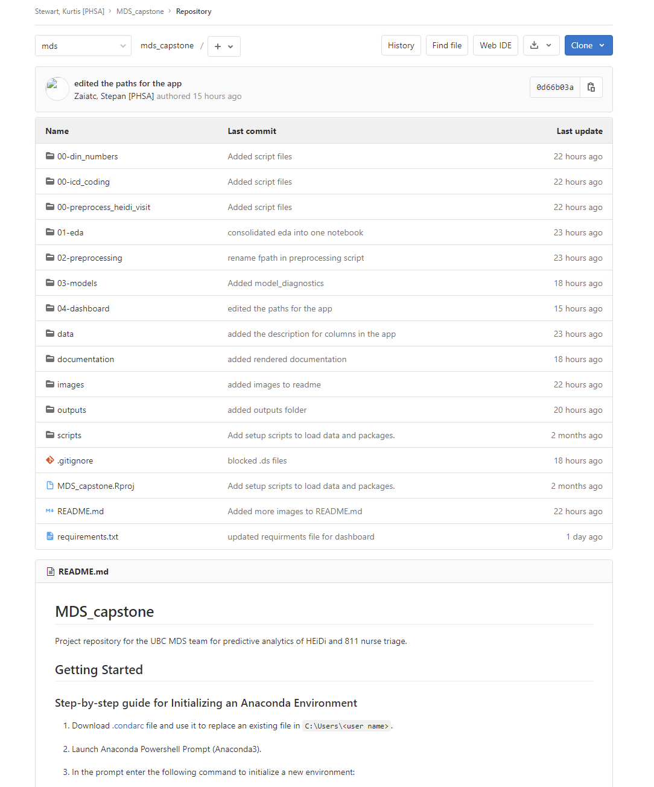
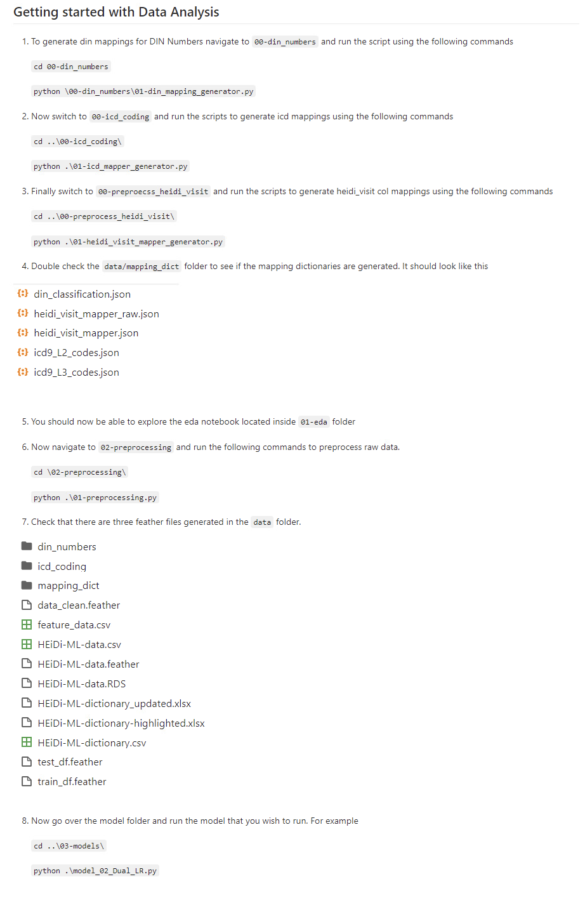
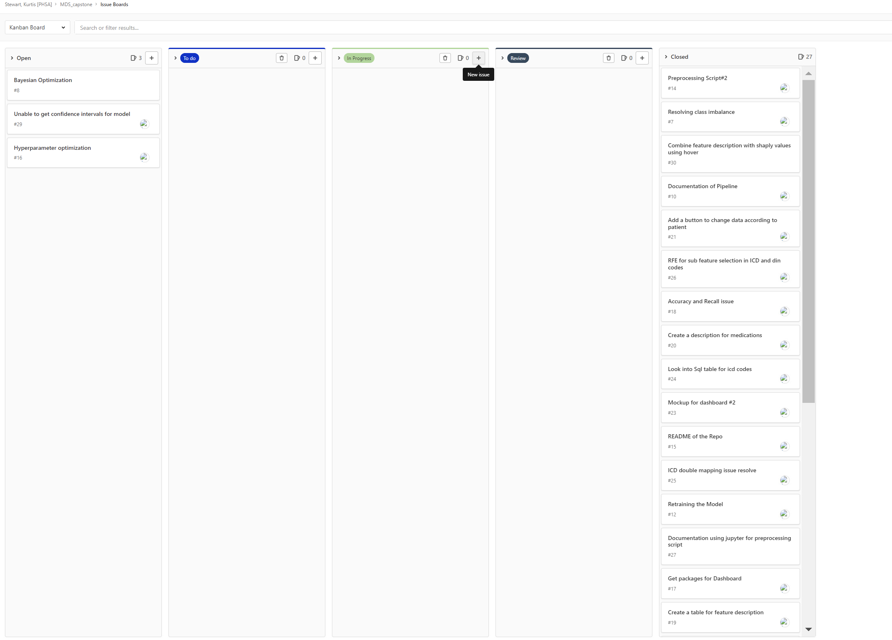

# heidi_dash

- [Overview](#overview)
- [Motivation and Purpose](#motivation-and-purpose)
- [Installation](#installation)
- [Description](#description)
- [App Sketch](#app-sketch)
- [Contributing](#contributing)
- [License](#license)

## Overview

The `heidi_dash` Dash app provides visualizations and statistics on the models trained on HEiDi dataset. The app is
primarily targeted towards nurses, policymakers, health professionals, and anyone interested in exploring and analyzing
triage prediction with interactive capabilities that allow them to study the accuracy of the models.

## Motivation and Purpose

Engineering an app to help nurses to make a triage decision may have a significant impact on patients as well as medical system overall. If the model performance can be of sufficient standard, it can be used to aid the nurse in making the traige decision.

## Data Pipeline

The data pipeline created during our analysis has been shown below. The output of this pipeline is incorporated in the dashboard delivered to the capstone partners. The folders marked with '00' are the initial setup which create the necessary data files to run the rest of the analysis.

Following this, we have the order of the pipeline as:
- 01-eda: An explorable notebook showcasing our findings during the exploratory phase of the project
- 02-preprocessing: An explorable notebook which guides the user through the preprocessing process
- 03-models: pipeline for building the models used in the teams analysis in a reprodcible manner as well as evaluation and diagnostics for the models.



The README file present in the repository below is a step by step guide for the capstone partners to fully explore the teams analysis.

The data pipeline also provides the foundations for further analyses which the partners can carry out however they wish.



Followinng is a Screenshot of the project kanban board used and managed by the team to effectively and efficiently keep track of the project status.



## Installation

Follow the following steps to reproduce the outputs:

1. Navigate to a folder of your choice on your local machine. Then open terminal from the folder and paste the following commands into it. You can install conda from [here](https://docs.conda.io/en/latest/miniconda.html)
```
conda create --name heidi-dash python=3.8
conda activate heidi-dash
```
2. Clone the repository, install the requirements and run the dashboard app
```
git clone https://github.com/stepanz25/heidi_dash.git
cd heidi_dash
pip install -r requirements.txt
python app.py
```
3. Copy the link from the command line on browser to view the dashboard.

## Description

The dashboard consists of one web page which displays information relevant to the nurse, as well as the model decision and interpretation. The dashboard shown below contains mock up data and does not contain any of the actual data. This has been done to ensure utmost privacy of the dataset that we worked with.

## App Sketch


## Contributing

Interested in contributing? Check out the contributing guidelines. We welcome and recognize all contributions. Please
find the guide for contribution in [Contributing Document](). Please note that this project is released with a Code of
Conduct. By contributing to this project, you agree to abide by its terms outlined [here]().

| Author                | Github Username |
|-----------------------|-----------------|
| Flora Ouedraogo       | @florawendy19   |
| Tanmay Agarwal        | @tanmayag97     |
| Waiel Hussain Tinwala | @WaielonH       |
| Stepan Zaiatc         | @stepanz25      |

## License

The materials of this project are licensed under the [MIT license](). If re-using/re-mixing please provide attribution
and link to this webpage.
