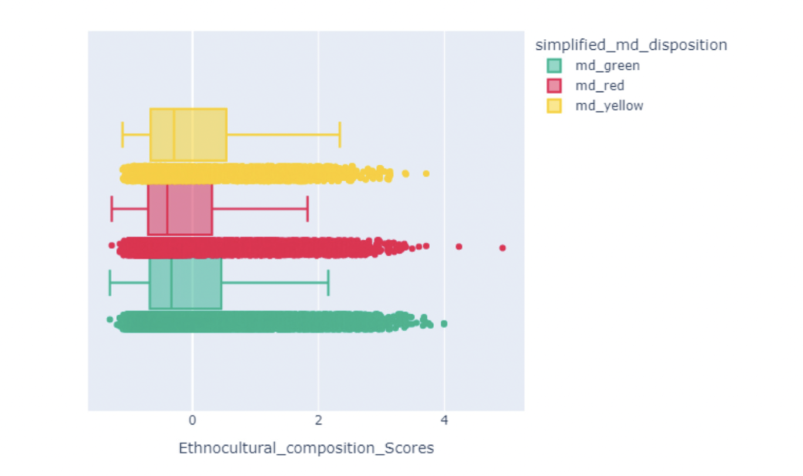

# Predictive analytics to support HLBC 8-1-1 and HEiDi triage

==Organization : UBC Digital Emergency Medecine==

==Authors :  Flora Ouedraogo, Stepan Zaiatc, Tanmay Agarwal,  Waiel Tinwala==


## Introduction

<div style="text-align: justify;">

The HealthLink BC 8-1-1 service includes HEiDi, a virtual support service with doctors. When people contact 8-1-1, they are connected with registered nurses who assess their condition based on professional judgment. If there's an emergency, patients receive virtual consultations with physicians through HEiDi on the same day. This has been successful in reducing visits to the Emergency Department. However, there is concern that some patients may be unnecessarily directed to the Emergency Department. 

To tackle this issue, our project aims to develop a model that assists nurses in making well-informed triage decisions by utilizing data from HEiDi physicians. We will conduct a comprehensive analysis of the data, employing various techniques for processing, classifying, and predicting. 

Our primary objective is to create an improved model that outperforms the current rule-based algorithm for triage. Additionally, we will develop a user-friendly Dash app that caters to both non-technical stakeholders, such as nurses, and more technical stakeholders, such as data scientists.
</div>

## Explanatory Data Analysis

#### Preview


To start off, we read in our data along with the data dictionaty both located in the data folder :

```
data = pd.read_csv('data/HEiDi-ML-data.csv', engine='python')
data = data[~datal'simplified md disposition'].isna()1
data dict = pd.read excel ('data/HEiDi-ML-dictionary updated.xsx')

```

#### Data information

```
data.info()
```
<figure markdown>

  
  <figcaption> Data Information.</figcaption>
</figure>

Our dataframe is relatively large with 33,597 rows and 307 columns. It contains a mix of numerical and object columns, with
a majority being numerical(float and integer) columns.

#### Data Description

```
data.describe()
```
<figure markdown>

  
  <figcaption> Data Information.</figcaption>
</figure>

As seen in the result above, the count of non-null values for several column is significantly lower than the total number of
rows in our data. This indicates a lot of missing values in our data.

#### Data Pattern and trends

<div style="text-align: justify;">


We started by studying the data to understand it better and find any noticeable patterns or trends. We looked at outliers and missing values and found that many variables had imbalances and missing values. Our analysis included 308 columns, which we divided into three main categories: Numeric, Binary, and Categorical.


We run the following code to filter the different data types:

```
binary_col = []
number claims = []
numeric col = []
primary_keys = ['CallID','PHN_e' ,'ENCOUNTER_ID']

for col in data.columns:
    if re.search('n_claims.*', col):
        number_claims.append(col)
    elif len(data[col].unique()) <= 3 and data[col].isna().any():
        binary_col.append(col)
    elif len(data[col].unique()) > 2 and data[col].dtype != 'object' and col not in primary_keys:
        numeric_col.append(col)

```

</div>


##### Missing values 

<div style="text-align: justify;">
We discovered that a considerable number of columns, such as `NAVInformed` and `NSInformed`, contained missing data exceeding 95%. Consequently, we made the decision to exclude these columns due to their limited potential to offer valuable insights in our predictive analysis and the possibility of introducing unnecessary noise.
</div>

<figure markdown>

  
  <figcaption> The plot shows a grid or a table with columns and rows. The color blue is used to represent the NA (Not
Available) values or missing data. In total, there are over 20 columns with over 95% values missing in their corresponding rows. </figcaption>
  
</figure>

<div style="text-align: justify;">
This image indicates that there is a widespread presence of missing values, represented by the blue color, across various columns in the dataset. This implies that a substantial amount of data is missing and requires further examination. As a result, we are currently in discussions with our Capstone Partner to understand the underlying reasons behind the missing data and decide on the necessary steps to resolve this issue.

</div>

##### The Problem of HEiDi Triage

<div style="text-align: justify;">
The existing system, known as the rule-based model, generates excessive false positives, leading to an unnecessary influx of people in the emergency department. The diagram presented illustrates the distribution of the target column, `simplified_md_disposition`, categorized according to the KBDisposition:
</div>

<figure markdown>

  
  <figcaption> Distribution of KBDisposition </figcaption>
  
</figure>

##### Class Imbalance

<div style="text-align: justify;">
 We also discovered a class imbalance that resulted in the "try home treatment" category being underrepresented. We needed to address this class imbalance to prevent any potential biases in our model.
</div>

<figure markdown>

  
  <figcaption> Distribution of simplified_md_disposition </figcaption>
  
</figure>

##### Correlation between features

###### Correlation between types of claims
<figure markdown>

  
  <figcaption> This plot illustrates the correlation heatmap that visualizes the relationship between the number of claims for
various specialty types, such as "Radiology", "Respirology", and "Gastroenterology", recorded over different time
periods (30-days, 90-days, 1-year).</figcaption>
</figure>

<div style="text-align: justify;">
The correlation heatmap displayed above illustrates the connection between the number of claims across various specialty types and time periods. It is based on data from a health insurance dataset. The heatmap has the specialty types and time periods (30 days, 90 days, and one year) represented on the x and y axes respectively. Each cell in the heatmap represents the correlation coefficient, indicating the strength and direction of the relationship between two specialty types and their corresponding time periods. Upon analyzing the heatmap, it becomes evident that there is no notable correlation among the different features. This finding suggests that the data quality is satisfactory.
</div>


<figure markdown>

  
  <figcaption> The plot depicts the relationship between patients' medical conditions and the frequency of their visits to the
emergency department (ED), as assessed by nurses. The "md_green" color indicates that patients can manage their
medical condition at home without requiring an ED visit. In contrast, the "md_yellow" and "md_red" colors suggest
that patients require ED visits, with the latter indicating more severe cases..</figcaption>
</figure>

<div style="text-align: justify;">
Problems related to Gastro, Respiratory and Cardiovascular seem to have higher ER cases.
However, patients also fall in the green category and have those problems as the leading cause as well. This
shows that they are the most common illness out there.

</div>


<figure markdown>

  
  <figcaption> The plot above represents the diversity and representation of different ethnic groups present by the target  feature `simplified_md_disposition` in the data.</figcaption>
</figure>


==The aforementioned plots were extracted during the exploratory data analysis (EDA) conducted on the dataset. The complete EDA can be accessed [#EDA](here)==
## Methods and Algorithms

### Methods


To develop a robust model that enhances nurse triaging, our project followed a structured data science research methodology, leading to key findings presented in the following sections. Our analysis began with an exploratory data analysis (EDA), a standard practice in data science projects, to gain a comprehensive understanding of the data and identify patterns and trends. The EDA findings guided us in eliminating redundant features and columns that did not contribute significantly to our predictions. Additionally, columns with more than 95% missing data were dropped to prevent noise introduction.


During the EDA phase, we employed various visualization techniques to draw insights and make informed decisions on feature selection. These techniques included examining correlation heatmaps for columns such as the number of claims, using matrix plots to identify missing values, and using bar plots to explore relationships between different columns based on the target variable levels (`md_green`, `md_yellow`, `md_red`). 
After conducting the EDA and consulting with experts, we proceeded to preprocess the data. This involved dropping a number of columns based on the insights gained from the EDA analysis and expert consultation. The data was then split into training and test sets, with an 80% training and 20% testing split. The partitioning was done in a balanced manner using a specific column called `PHN_e`.


Several preprocessing steps were applied to various columns, including removing rows with missing values in the target class, filling in missing values with placeholders, converting string values into lists separated by commas, exploding columns such as `chronic disease` and `invoice_feature`, and extracting features such as the hour from the datetime feature. A notable preprocessing step was also performed on the `px_DIN` feature. Detailed information about all the preprocessing steps can be found [#Scripts](here).


Following the preprocessing stage, we explored potential models for fitting based on expert consultation and literature review. The models we considered in our analysis included the `Dummy Classifier`, `Decision Tree Classifier`, `Random Forest`, `Logistic Regression`, and `XGBoost`. For detailed information on each of these models, please refer to the [#algorithms](here). 


After analyzing the performance of each model, we selected the best-performing model, referred to as the [model](best-mode), to build the dashboard for stakeholders. The results obtained from this model serve as the foundation for the dashboard, providing valuable insights for stakeholders involved in the triaging process.


### Algorithms

<div style="text-align: justify;">
In our quest to identify the best-performing model, we evaluated five different algorithms: [`Dummy Classifier`](dummy-classifier), [`Decision Tree Classifier`](#decision-tree-classifier), [`Logistic Regression`](#logistic-regression), [`Random Forest`](#random-forest) and [`XGBoost`](#xgboost). 
We selected the Dummy Classifier algorithm due to its scalability and ability to handle sparse data, which was particularly relevant in our case given the presence of multiple categorical features with sparsity in our model. Similarly, we opted for the Logistic Regression algorithm, which shares similar advantages with the Dummy Classifier and offers the added benefit of interpretability for feature importance selection. Considering the simplicity and ease of implementation, we included the `Decision Tree Classifier` as a baseline model. However, we acknowledge the potential for overfitting with this algorithm. To mitigate overfitting concerns, we incorporated the `Random Forest` model, which utilizes an ensemble of multiple decision trees to reduce overfitting while maintaining predictive performance. Lastly, we explored the `XGBoost` model, leveraging its various advantages. These include higher predictive accuracy, built-in regularization (such as L1 and L2 regularization) to prevent overfitting, and the ability to correct errors at each iteration after constructing each tree. During training, `XGBoost` learns how to handle missing values at each split point, reducing bias in the model. By considering these five algorithms, we aimed to identify the model that best suits our specific requirements and maximizes predictive performance while addressing potential overfitting concerns.\
</div>

<div style="text-align: justify;">
In our problem statement, we prioritized two performance metrics: Recall and F1 score, with Recall being of higher importance. Our primary focus was to ensure that the model performs better than the current rule-based algorithm, while minimizing the risk of under-triaging and ensuring the identification of actual patients who need to be sent to the Emergency Room (ER). Minimizing Type 2 errors (error of omission) was crucial to achieve better outcomes for our partner. We aimed to accurately identify and capture patients who require urgent care, thereby reducing the likelihood of missed cases. Recall, as a fundamental performance metric, played a significant role in evaluating the model's ability to correctly identify true positive cases. Although the precision of the model, indicated by Type 1 errors (false positives), was relatively less prioritized, it was still taken into consideration. In this context, having a conservative model that may occasionally classify patients incorrectly as needing ER attention was deemed acceptable. The overall objective was to strike a balance between correctly identifying patients who require urgent care and minimizing unnecessary visits to the ER. By focusing on Recall and considering the significance of both Type 1 and Type 2 errors, we aimed to develop a model that effectively prioritizes patient safety and improves the overall triaging process::
</div>


#### Dummy Classifier

#### Decision Tree Classifier

#### Random Forest

#### Logistic Regression

#### XGBoost

## Project Analysis

### Scripts

#### Preprocessing Script

To execute the preprocessing script [`preprocessing4.py`](#) , which includes all the preprocessing steps, run the following command: 

```
python src/preprocessing4.py

```


Below is the detailed structure and explanation of the script:


[`Load Dataset`](#)
<div style="text-align: justify;">
This section of the script loads the raw dataset from a CSV file and removes rows containing missing values in the target column 
</div>

[`Drop Unnecessary Columns`](#)
<div style="text-align: justify;">
The script reads a file (`drop_columns.txt`) that contains a list of column names to be dropped. It drops the specified columns from the dataset. These are the columns that do not contribute in the prediction.
</div>

[`Preprocess `chronic_disease`  Feature`](#) 
<div style="text-align: justify;">
The `chronic_disease` column contains grouped lists that needed to be expanded and concatenated. To achieve this, we first handled missing values in the column by filling them with a placeholder. Then, we split the strings in the column using commas as delimiters to create a list of individual strings. 
Next, we applied the multilabel binarization technique to perform one-hot encoding on the `chronic_disease` feature. Subsequently, the original `chronic_disease` column was removed from the dataset, and the newly created one-hot encoded features were added. 
It is important to highlight that in our approach, we assumed that missing data in the `chronic_disease` column indicated the absence of any chronic disease.
</div>

[`Preprocess `n_claims_*` Features`](#)

<div style="text-align: justify;">
The `n_claims_` column, similar to the `chronic_disease` column mentioned earlier, also consists of grouped lists that needed to be expanded. To accomplish this, we created a list of invoice features and extracted specialty types from the column names. 
Specifically, we calculated the ratio between the data from the past one year and the past 30 days for each specialty. This was done by dividing the values in the 'n_claims_1yr_specialty' column by the corresponding values in the 'n_claims_30day_specialty' column. We identified a total of 194 columns that contained the term 'n_claims' in their names, and we extracted those columns. 
By taking the ratio, we aimed to combine correlated features in the dataset, as we wanted to avoid having highly correlated features. To prevent division by zero errors, we ensured that the invoice data was incremented by 1 before performing the division. 
Finally, we dropped the original invoice columns from the dataset and added the new ratio columns that were calculated based on the `n_claims_` data. 
</div>


[`Extract Hour from `FinalDispositionAtLocal` Feature`](#)
<div style="text-align: justify;">
We extracted the hour component from the `FinalDispositionAtLocal` datetime feature. Subsequently, we removed the original `FinalDispositionAtLocal` column from the dataset. 
</div>


[`Convert `Id` Variables into Categoricals`](#)

<div style="text-align: justify;">
Although the values in the dataset are numerical, they represent ID variables that hold categorical information. Therefore, we converted these numerical ID variables into categorical variables. 
</div>

[`Preprocess `CallServiceTagged` Feature`](#)

<div style="text-align: justify;">
Similar to the `chronic_disease` and `n_claims_ columns`, the `CallServiceTagged` column also requires expansion. To achieve this, we handled missing values in the `CallServiceTagged` column by replacing them with a placeholder value. Then, we split the strings in the column using the '|' delimiter to create a list of individual strings. 
Afterwards, we applied the multilabel binarization technique to perform one-hot encoding on the resulting multilabel features. Finally, we removed the original `CallServiceTagged` column from the dataset and added the newly created one-hot encoded features. 
</div>

[`Functions/Methods (Split data)`](#)
<div style="text-align: justify;">
The script contains a function called `split_data` that is responsible for dividing the dataset into training and testing sets using the `PHN_e` column as the basis for the split. A random seed value of 42 is used for the randomization process to ensure reproducibility. 
The `split_data` function accepts three parameters: `clean_data`, which represents the dataset to be split, col, which specifies the column used for the split (in this case, it is `PHN_e`), and seed, which is the seed value for random number generation. 
Within the `split_data` function, the unique values of the specified column are shuffled. Then, the shuffled values are divided into an 80% portion for training and a 20% portion for testing. The resulting training dataset is stored in the `train_df` variable, while the testing dataset is stored in the `test_df` variable. 
</div>

[`Save Preprocessed Data to Feather Format`](#)

<div style="text-align: justify;">
The processed dataset, training dataset, and testing dataset are stored in Feather files to be used for model fitting. 
</div>

[`Output`](#)


#### Split Data Script 

The following is a docstring of the script [`split_data.py`](#)

```
def split_data(clean_data: pd.DataFrame, col: str, seed: int) -> tuple:
  """
    Splits the clean data into training and test datasets based on the specified column.

    Parameters:
        clean_data (pd.DataFrame): The clean data to be split.
        col (str): The column name used to split the data.
        seed (int): The random seed for shuffling the unique values.

    Returns:
        tuple: A tuple containing two pd.DataFrame objects: (train_df, test_df).
               train_df: The training dataset.
               test_df: The test dataset.

    Notes:
        - This function shuffles the data based on the specified unique identifier column and
          splits the data into training and test sets.
        - The split ratio is 80:20, where 80% of the data is used for training and 20% is used for testing.
        - A fixed seed is used for reproducibility.
        - The function drops columns that meet either of the following conditions:
            1. The column has fewer than two unique values in the training dataset.
            2. The column used for splitting the data.
        - The "index" column is dropped as well.

    Examples:
        train_data, test_data = split_data(clean_data, 'category', 42)
    """
```
#### DIN Decoder Script

The following is a docstring of the script [`din_decoder.py`](#)
```

def convert_din_to_text(din_list, group='TC2'):
    
    Converts a list of DIN (Drug Identification Number) codes to corresponding text labels based on the specified group.

    Parameters:
        din_list (list): A list of DIN codes to be converted to text labels.
        group (str, optional): Specifies the group to use for mapping DIN codes to text labels. Default is 'TC2'.

    Returns:
        list: A list of unique text labels corresponding to the input DIN codes.

    Notes:
        - This function reads the DIN classification data from the 'din_classification.json' file.
        - Each DIN code in the input list is converted to a string.
        - The function tries to find the corresponding text label in the DIN classification dictionary using the specified group.
        - If the DIN code is not found or encounters an exception, it is labeled as 'Other'.
        - The function returns a list of unique text labels.

    Example:
        converted_labels = convert_din_to_text(['123456', '789012'], group='TC2')

def decode_din(data, col_name, group='TC2'):
    """
    Decodes DIN codes in a DataFrame column by applying the convert_din_to_text function.

    Parameters:
        data: The input DataFrame containing the column to decode.
        col_name (str): The name of the column in the DataFrame to decode DIN codes from.
        group (str, optional): Specifies the group to use for mapping DIN codes to text labels. Default is 'TC2'.

    Returns:
        pandas.DataFrame: A modified copy of the input DataFrame with the specified column decoded.

    Notes:
        - This function creates a temporary copy of the input DataFrame.
        - The specified column values are split by ';' delimiter.
        - The convert_din_to_text function is applied to the split values, using the specified group.
        - The resulting text labels are stored in the modified copy of the DataFrame.
    """
    
```

#### Multi Label Binazer 

The following is a docstring of the script [`mlb.py`](#)
```
def multi_label_binarizer(data: pd.DataFrame, col_name: str) -> pd.DataFrame:
    """
    Perform multi-label binarization on a column in the given DataFrame.

    Parameters:
        data (pd.DataFrame): The input DataFrame containing the data to be binarized.
        col_name (str): The name of the column to be binarized.

    Returns:
        pd.DataFrame: The resulting DataFrame after performing multi-label binarization.
                      The original DataFrame is concatenated with the binarized columns.

    Notes:
        - This function performs multi-label binarization on a specified column in the given DataFrame.
        - The column is expected to contain lists or arrays of labels.
        - Each label in the column is treated as a separate binary feature, and a new column is created for each unique label.
        - If a label appears in a row, the corresponding column value is set to 1; otherwise, it is set to 0.

    Examples:
        >>> binarized_data = multi_label_binarizer(data, 'labels')
    """

```

#### Column Heidi_visit Cleaning Script 

The following is a docstring of the script [`heidi_visit_clean.py`](#)

```
def my_func(x):
    """
    Maps a value to its corresponding key in the mapping dictionary.

    Parameters:
        x: The value to be mapped.
    Returns:
        str: The corresponding key if found in the mapping dictionary.
        np.nan: If the value is not found in any of the dictionary's values.

    Notes:
        - This function iterates over the keys of the mapping dictionary.
        - If the value is found in any of the dictionary's values, the corresponding key is returned.
        - If the value is not found in any of the dictionary's values, np.nan is returned.
    """


def clean_heidi_visit_col(data):
    """
    Clean the 'heidi VISIT REASON' column in the given DataFrame.

    Parameters:
        data: The input DataFrame containing the column to be cleaned.

    Returns:
        pandas.DataFrame: The input DataFrame with the 'heidi VISIT REASON' column cleaned.

    Notes:
        - This function performs several cleaning operations on the 'heidi VISIT REASON' column:
            - Replaces '[\.0\\*,-]' with an empty string.
            - Replaces '*/I' with an empty string.
            - Replaces '&' with an empty string.
            - Converts the column values to lowercase and removes leading/trailing whitespace.
        - The my_func() function is applied to each cleaned value to map it to its corresponding key.
        - The resulting mapped values are stored in the 'heidi_VISIT_REASON clean' column of the input DataFrame.
    """
```


#### Preprocessing heidi_visit Script

The following is a docstring of the script [`helper.py`](#)
```
def process_grouped(data, col, split):
    """
    Process a grouped column in the given DataFrame by performing multilabel binarization.

    Parameters:
        data: The input DataFrame containing the grouped column.
        col (str): The name of the grouped column to be processed.
        split (str): The delimiter used to split the values in the grouped column.

    Returns:
        pandas.DataFrame: A DataFrame with the processed grouped column after multilabel binarization.

    Notes:
        - This function selects the specified grouped column from the DataFrame and fills missing values with 'MISSING'.
        - The column values are split based on the provided delimiter.
        - Multilabel binarization is applied to the split values using the sklearn MultiLabelBinarizer.
        - The resulting binary features are stored in a new DataFrame, where column names are formatted as 'col__class'.
    """

def process_cat(data, col):
    """
    Process a categorical column in the given DataFrame by performing various cleaning operations.

    Parameters:
        data: The input DataFrame containing the categorical column.
        col (str): The name of the categorical column to be processed.

    Returns:
        pandas.DataFrame: The input DataFrame with the processed categorical column.

    Notes:
        - This function applies several cleaning operations to the specified categorical column:
            - Replaces '[\.()\[\]*,-]' with an empty string.
            - Replaces '/' with a space.
            - Replaces '&' with 'and'.
            - Replaces multiple spaces with a single space.
            - Converts the column values to lowercase and removes leading/trailing whitespace.
            - Replaces spaces with underscores.
        - The processed values are stored back in the original DataFrame under the specified column name.
    """

```
#### ICD Codes Decoder Script

The following is a docstring of the script [`icd_codes_decoder.py`](#)

```
def convert_icd(x, granularity=2):
    """
    Convert an ICD (International Classification of Diseases) code to its corresponding description based on the specified granularity.

    Parameters:
        x (str): The ICD code to be converted.
        granularity (int, optional): Specifies the granularity level of the ICD code. Default is 2.

    Returns:
        str: The description of the ICD code at the specified granularity.

    Notes:
        - This function reads the ICD code mappings from the 'icd9_L2_codes.json' and 'icd9_L3_codes.json' files.
        - The function tries to find the corresponding description based on the provided code and granularity.
        - If the code is not found, it returns "Other ICD Code".

    Example:
        description = convert_icd('123456', granularity=2)
    """


def extract_codes(id_list):
    """
    Extract unique ICD codes from a list and convert them to their descriptions.

    Parameters:
        id_list (list): A list of ICD codes to be extracted.

    Returns:
        list: A list of unique ICD code descriptions.

    Notes:
        - This function removes duplicate ICD codes from the input list.
        - Each ICD code is converted to its corresponding description using the convert_icd function.
        - The function returns a list of unique ICD code descriptions.

    Example:
        extracted_codes = extract_codes(['123456', '789012'])
    """


def decode_icd(data, col_name):
    """
    Decode ICD codes in a DataFrame column by applying the extract_codes function.

    Parameters:
        data: The input DataFrame containing the column to decode.
        col_name (str): The name of the column in the DataFrame to decode ICD codes from.

    Returns:
        pandas.DataFrame: A modified copy of the input DataFrame with the specified column decoded.

    Notes:
        - This function creates a temporary copy of the input DataFrame.
        - The specified column values are split by ';' delimiter.
        - The extract_codes function is applied to the split values.
        - The resulting ICD code descriptions are stored in the modified copy of the DataFrame.

    Example:
        decoded_df = decode_icd(data, 'icd_column')
    """


def combine_icd_codes(data, col_names=['msp_dx', 'hosp_dx', 'ed_dx']):
    """
    Combine multiple ICD code columns into a single column in the DataFrame.

    Parameters:
        data: The input DataFrame containing the ICD code columns.
        col_names (list, optional): The names of the ICD code columns to combine. Default is ['msp_dx', 'hosp_dx', 'ed_dx'].

    Returns:
        pandas.DataFrame: The input DataFrame with the combined ICD code column.

    Notes:
        - This function creates a new column named 'all_icd_codes' in the DataFrame.
        - The values from the specified ICD code columns are concatenated using ';' as the delimiter.
        - The original ICD code columns are dropped from the DataFrame.

    Example:
        combined_df = combine_icd_codes(data, col_names=['column1', 'column2'])
    """


def multi_label_binarizer(data, col_name):
    """
    Perform multilabel binarization on a column in the DataFrame.

    Parameters:
        data: The input DataFrame containing the column to perform multilabel binarization on.
        col_name (str): The name of the column to be binarized.

    Returns:
        pandas.DataFrame: The input DataFrame with the binarized columns added.

    Notes:
        - This function creates a temporary Series by exploding the specified column.
        - A count column is added to the temporary Series.
        - The temporary Series is then pivoted to obtain a DataFrame with binarized columns.
        - Missing values are filled with 0, and the column names are prefixed with 'col_name_'.
        - The original column specified is dropped from the DataFrame, and the binarized columns are concatenated.

    Example:
        binarized_df = multi_label_binarizer(data, 'column_name')
    """


```

### Imputation Techniques 

<div style="text-align: justify;">
One of the primary challenges we faced in our project is dealing with class imbalance, as there is a significant disparity between the number of patients who required immediate assistance at the emergency department and those who were advised to stay at home and practice self-care. This class imbalance could have potentially introduced bias in the predictive model, leading to poor performance on the minority class. To mitigate this challenge, we used an oversampling technique, specifically the Synthetic Minority Over-sampling Technique for Nominal and Continuous (SMOTE-NC). SMOTE-NC generates synthetic samples for the "stay at home and self-care" class by creating new observations that combine existing observations from the minority class. These new observations are created through interpolation between the existing minority class samples and the addition of random perturbations to the feature values. By using SMOTE-NC, we aim to create a more balanced training set that includes an adequate representation of the minority class. This approach helped improve the performance of our predictive model on the minority class, ensuring that it is not biased towards the majority class.
</div>

### Dropped Columns

The list of columns with their explantions can be found below:

```
{{ read_excel('table/dropped_columns.xlsx', engine='openpyxl') }}
```


## Final Results

### Dashboard

You can locate the dashboards and its corresponding documentation [`here`](#)

## Future Scope


We believe that the next phase of this project could prioritize the enhancement of feature engineering and selection
methods, particularly with a ficus on DIN numbers and ICD codes. By making significant improvements in these areas, the
project can unlock more valuable information from the data and achieve notably improved accuracy in its analyses.


==Feature Selection:== Despite the team's efforts in conducting feature selection within the given time constraints, we strongly
believe that there is further scope for carefully choosing the most essential features. By employing this approach, we can
effectively decrease the data size that needs to be processed. Consequently, this will accelerate the analysis process and
optimize the utilization of computational resources.


==Using Multiple Models:== Another area for improvement in the analysis is enhancing the accuracy. One approach to achieve
this is by exploring the integration of multiple models. By leveraging the strengths of different models and combining their
unique capabilities, we can obtain superior results. This approach is similar to teamwork, where each model brings its own
valuable insights. however, it is important to remember that using multiple models requires more computational resourses.
therefore, it is crucial to carefully consider the available resourses before implementing this approach.


==Making the Most of Patient Notes:== We believe that accessing patient notes can be a game-changer in our analysis. These
notes contain detailed information that can greatly enhance our understanding of medical conditions and patient outcomes.
By using language processing techniques, we can unlock the power of patient notes. This helps us extract important insights
from written information leading to better predictions and improved performance.


In sum, to futher improve the analysis, we believe that there is need to keep exploring and refining the methods. By focusing
on DIN numbers and ICD codes, using feature selection, trying multiple models, and leveraging patient notes with language
processing, we can achiev more accurate and insighful results. These adancements have the potential to transform the scope
of this project, leading to better care and outcomes for patients.
