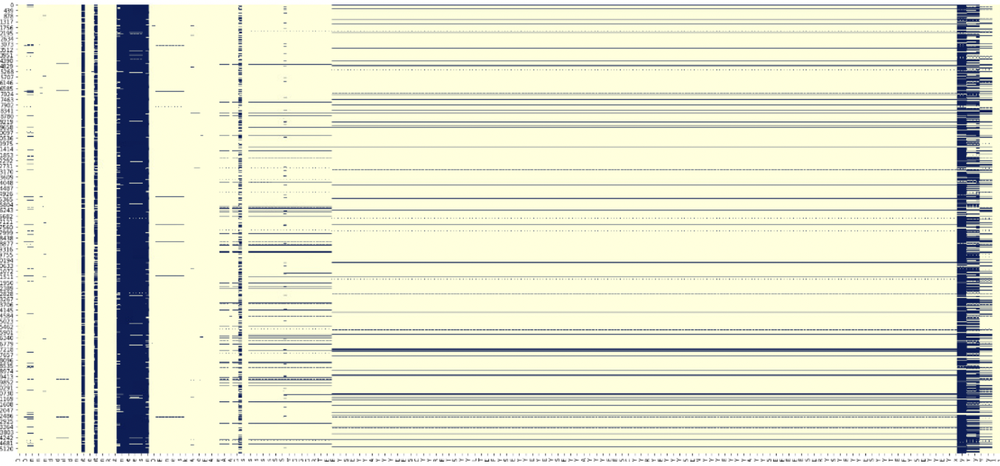
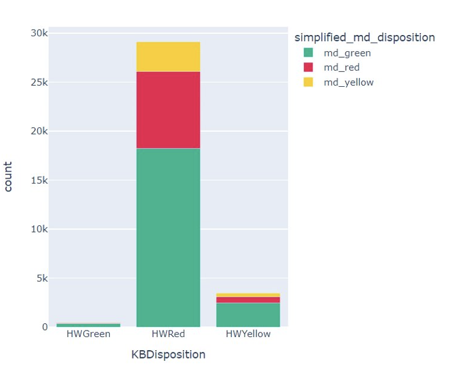
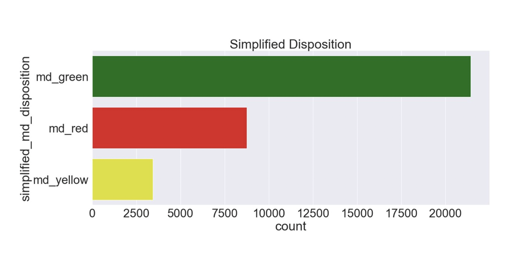
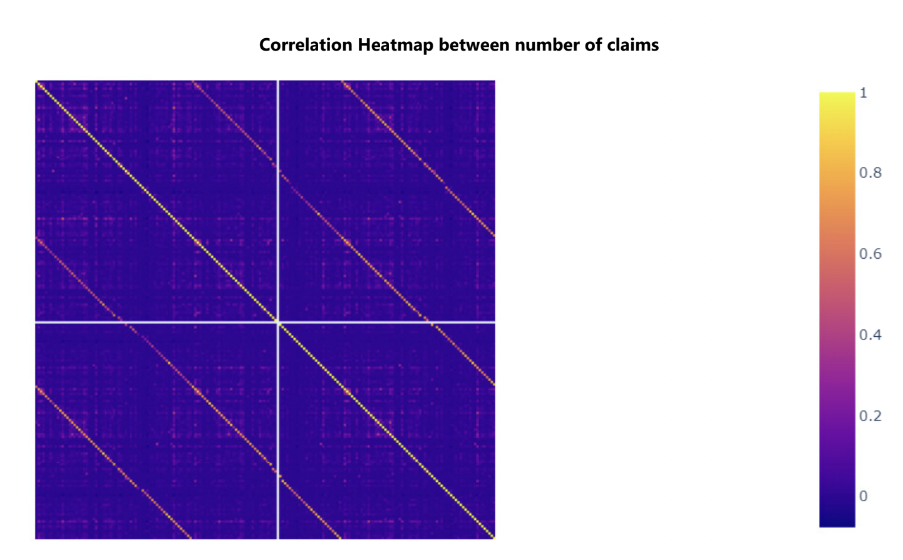
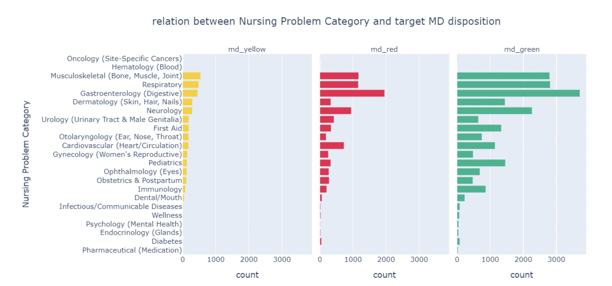

# Predictive analytics to support HLBC 8-1-1 and HEiDi triage

==Organization : UBC Digital Emergency Medecine==

==Authors :  Flora Ouedraogo, Stepan Zaiatc, Tanmay Agarwal,  Waiel Tinwala==


## Introduction

<div style="text-align: justify;">

The HealthLink BC 8-1-1 service includes HEiDi, a virtual support service with doctors. When people contact 8-1-1, they are connected with registered nurses who assess their condition based on professional judgment. If there's an emergency, patients receive virtual consultations with physicians through HEiDi on the same day. This has been successful in reducing visits to the Emergency Department. However, there is concern that some patients may be unnecessarily directed to the Emergency Department. 

To tackle this issue, our project aims to develop a model that assists nurses in making well-informed triage decisions by utilizing data from HEiDi physicians. We will conduct a comprehensive analysis of the data, employing various techniques for processing, classifying, and predicting. 

Our primary objective is to create an improved model that outperforms the current rule-based algorithm for triage. Additionally, we will develop a user-friendly Dash app that caters to both non-technical stakeholders, such as nurses, and more technical stakeholders, such as data scientists.
</div>

## Explanatory Data Analysis


#### Preview

To start off, we read in our data along with the data dictionaty both located in the data folder :

```
data = pd.read_csv('data/HEiDi-ML-data.csv', engine='python')
data = data[~datal'simplified md disposition'].isna()1
data dict = pd.read excel ('data/HEiDi-ML-dictionary updated.xsx')

```

<div style="text-align: justify;">

We started by studying the data to understand it better and find any noticeable patterns or trends. We looked at outliers and missing values and found that many variables had imbalances and missing values. Our analysis included 308 columns, which we divided into three main categories: Numeric, Binary, and Categorical.


We run the following code to filter the different data types:

```
binary_col = []
number claims = []
numeric col = []
primary_keys = ['CallID','PHN_e' ,'ENCOUNTER_ID']

for col in data.columns:
    if re.search('n_claims.*', col):
        number_claims.append(col)
    elif len(data[col].unique()) <= 3 and data[col].isna().any():
        binary_col.append(col)
    elif len(data[col].unique()) > 2 and data[col].dtype != 'object' and col not in primary_keys:
        numeric_col.append(col)

```

</div>


#### Missing values 

<div style="text-align: justify;">
We discovered that a considerable number of columns, such as `NAVInformed` and `NSInformed`, contained missing data exceeding 95%. Consequently, we made the decision to exclude these columns due to their limited potential to offer valuable insights in our predictive analysis and the possibility of introducing unnecessary noise.
</div>

<figure markdown>

  
  <figcaption> The plot shows a grid or a table with columns and rows. The color blue is used to represent the NA (Not
Available) values or missing data. In total, there are over 20 columns with over 95% values missing in their corresponding rows. </figcaption>
  
</figure>

<div style="text-align: justify;">
This image indicates that there is a widespread presence of missing values, represented by the blue color, across various columns in the dataset. This implies that a substantial amount of data is missing and requires further examination. As a result, we are currently in discussions with our Capstone Partner to understand the underlying reasons behind the missing data and decide on the necessary steps to resolve this issue.

</div>

#### The Problem of HEiDi Triage

<div style="text-align: justify;">
The existing system, known as the rule-based model, generates excessive false positives, leading to an unnecessary influx of people in the emergency department. The diagram presented illustrates the distribution of the target column, `simplified_md_disposition`, categorized according to the KBDisposition:
</div>

<figure markdown>

  
  <figcaption> Distribution of KBDisposition </figcaption>
  
</figure>

#### Class Imbalance

<div style="text-align: justify;">
 We also discovered a class imbalance that resulted in the "try home treatment" category being underrepresented. We needed to address this class imbalance to prevent any potential biases in our model.
</div>

<figure markdown>

  
  <figcaption> Distribution of simplified_md_disposition </figcaption>
  
</figure>

#### More EDA plots

<figure markdown>

  
  <figcaption> This plot illustrates the correlation heatmap that visualizes the relationship between the number of claims for
various specialty types, such as "Radiology", "Respirology", and "Gastroenterology", recorded over different time
periods (30-days, 90-days, 1-year).</figcaption>
</figure>

<div style="text-align: justify;">
The correlation heatmap displayed above illustrates the connection between the number of claims across various specialty types and time periods. It is based on data from a health insurance dataset. The heatmap has the specialty types and time periods (30 days, 90 days, and one year) represented on the x and y axes respectively. Each cell in the heatmap represents the correlation coefficient, indicating the strength and direction of the relationship between two specialty types and their corresponding time periods. Upon analyzing the heatmap, it becomes evident that there is no notable correlation among the different features. This finding suggests that the data quality is satisfactory.
</div>


<figure markdown>

  
  <figcaption> The plot depicts the relationship between patients' medical conditions and the frequency of their visits to the
emergency department (ED), as assessed by nurses. The "md_green" color indicates that patients can manage their
medical condition at home without requiring an ED visit. In contrast, the "md_yellow" and "md_red" colors suggest
that patients require ED visits, with the latter indicating more severe cases..</figcaption>
</figure>

<div style="text-align: justify;">
Problems related to Gastro, Respiratory and Cardiovascular seem to have higher ER cases.
However, patients also fall in the green category and have those problems as the leading cause as well. This
shows that they are the most common illness out there.

</div>


## Methods and Algorithms

### Methods


To develop a robust model that enhances nurse triaging, our project followed a structured data science research methodology, leading to key findings presented in the following sections. Our analysis began with an exploratory data analysis (EDA), a standard practice in data science projects, to gain a comprehensive understanding of the data and identify patterns and trends. The EDA findings guided us in eliminating redundant features and columns that did not contribute significantly to our predictions. Additionally, columns with more than 95% missing data were dropped to prevent noise introduction.


During the EDA phase, we employed various visualization techniques to draw insights and make informed decisions on feature selection. These techniques included examining correlation heatmaps for columns such as the number of claims, using matrix plots to identify missing values, and using bar plots to explore relationships between different columns based on the target variable levels (`md_green`, `md_yellow`, `md_red`). 
After conducting the EDA and consulting with experts, we proceeded to preprocess the data. This involved dropping a number of columns based on the insights gained from the EDA analysis and expert consultation. The data was then split into training and test sets, with an 80% training and 20% testing split. The partitioning was done in a balanced manner using a specific column called `PHN_e`.


Several preprocessing steps were applied to various columns, including removing rows with missing values in the target class, filling in missing values with placeholders, converting string values into lists separated by commas, exploding columns such as `chronic disease` and `invoice_feature`, and extracting features such as the hour from the datetime feature. A notable preprocessing step was also performed on the `px_DIN` feature. Detailed information about all the preprocessing steps can be found [#Scripts](here).


Following the preprocessing stage, we explored potential models for fitting based on expert consultation and literature review. The models we considered in our analysis included the `Dummy Classifier`, `Decision Tree Classifier`, `Random Forest`, `Logistic Regression`, and `XGBoost`. For detailed information on each of these models, please refer to the [#algorithms](here). 


After analyzing the performance of each model, we selected the best-performing model, referred to as the [model](best-mode), to build the dashboard for stakeholders. The results obtained from this model serve as the foundation for the dashboard, providing valuable insights for stakeholders involved in the triaging process.


### Algorithms

<div style="text-align: justify;">
In our quest to identify the best-performing model, we evaluated five different algorithms: [`Dummy Classifier`](dummy-classifier), [`Decision Tree Classifier`](#decision-tree-classifier), [`Logistic Regression`](#logistic-regression), [`Random Forest`](#random-forest) and [`XGBoost`](#xgboost). 
We selected the Dummy Classifier algorithm due to its scalability and ability to handle sparse data, which was particularly relevant in our case given the presence of multiple categorical features with sparsity in our model. Similarly, we opted for the Logistic Regression algorithm, which shares similar advantages with the Dummy Classifier and offers the added benefit of interpretability for feature importance selection. Considering the simplicity and ease of implementation, we included the `Decision Tree Classifier` as a baseline model. However, we acknowledge the potential for overfitting with this algorithm. To mitigate overfitting concerns, we incorporated the `Random Forest` model, which utilizes an ensemble of multiple decision trees to reduce overfitting while maintaining predictive performance. Lastly, we explored the `XGBoost` model, leveraging its various advantages. These include higher predictive accuracy, built-in regularization (such as L1 and L2 regularization) to prevent overfitting, and the ability to correct errors at each iteration after constructing each tree. During training, `XGBoost` learns how to handle missing values at each split point, reducing bias in the model. By considering these five algorithms, we aimed to identify the model that best suits our specific requirements and maximizes predictive performance while addressing potential overfitting concerns.\
</div>

<div style="text-align: justify;">
In our problem statement, we prioritized two performance metrics: Recall and F1 score, with Recall being of higher importance. Our primary focus was to ensure that the model performs better than the current rule-based algorithm, while minimizing the risk of under-triaging and ensuring the identification of actual patients who need to be sent to the Emergency Room (ER). Minimizing Type 2 errors (error of omission) was crucial to achieve better outcomes for our partner. We aimed to accurately identify and capture patients who require urgent care, thereby reducing the likelihood of missed cases. Recall, as a fundamental performance metric, played a significant role in evaluating the model's ability to correctly identify true positive cases. Although the precision of the model, indicated by Type 1 errors (false positives), was relatively less prioritized, it was still taken into consideration. In this context, having a conservative model that may occasionally classify patients incorrectly as needing ER attention was deemed acceptable. The overall objective was to strike a balance between correctly identifying patients who require urgent care and minimizing unnecessary visits to the ER. By focusing on Recall and considering the significance of both Type 1 and Type 2 errors, we aimed to develop a model that effectively prioritizes patient safety and improves the overall triaging process::
</div>


#### Dummy Classifier

#### Decision Tree Classifier

#### Random Forest

#### Logistic Regression

#### XGBoost

## Project Analysis

### Scripts

#### Preprocessing Script

<div style="text-align: justify;">
To execute the preprocessing script, which includes all the preprocessing steps, run the following command: 

```
python src/preprocessing.py

```
</div>

Below is the detailed structure and explanation of the script:


[`Load Dataset`](#)
<div style="text-align: justify;">
This section of the script loads the raw dataset from a CSV file and removes rows containing missing values in the target column 
</div>

[`Drop Unnecessary Columns`](#)
<div style="text-align: justify;">
The script reads a file (`drop_columns.txt`) that contains a list of column names to be dropped. It drops the specified columns from the dataset. These are the columns that do not contribute in the prediction.
</div>

[`Preprocess `chronic_disease`  Feature`](#) 
<div style="text-align: justify;">
The `chronic_disease` column contains grouped lists that needed to be expanded and concatenated. To achieve this, we first handled missing values in the column by filling them with a placeholder. Then, we split the strings in the column using commas as delimiters to create a list of individual strings. 
Next, we applied the multilabel binarization technique to perform one-hot encoding on the `chronic_disease` feature. Subsequently, the original `chronic_disease` column was removed from the dataset, and the newly created one-hot encoded features were added. 
It is important to highlight that in our approach, we assumed that missing data in the `chronic_disease` column indicated the absence of any chronic disease.
</div>

[`Preprocess `n_claims_*` Features`](#)

<div style="text-align: justify;">
The `n_claims_` column, similar to the `chronic_disease` column mentioned earlier, also consists of grouped lists that needed to be expanded. To accomplish this, we created a list of invoice features and extracted specialty types from the column names. 
Specifically, we calculated the ratio between the data from the past one year and the past 30 days for each specialty. This was done by dividing the values in the 'n_claims_1yr_specialty' column by the corresponding values in the 'n_claims_30day_specialty' column. We identified a total of 194 columns that contained the term 'n_claims' in their names, and we extracted those columns. 
By taking the ratio, we aimed to combine correlated features in the dataset, as we wanted to avoid having highly correlated features. To prevent division by zero errors, we ensured that the invoice data was incremented by 1 before performing the division. 
Finally, we dropped the original invoice columns from the dataset and added the new ratio columns that were calculated based on the `n_claims_` data. 
</div>


[`Extract Hour from `FinalDispositionAtLocal` Feature`](#)
<div style="text-align: justify;">
We extracted the hour component from the `FinalDispositionAtLocal` datetime feature. Subsequently, we removed the original `FinalDispositionAtLocal` column from the dataset. 
</div>


[`Convert `Id` Variables into Categoricals`](#)

<div style="text-align: justify;">
Although the values in the dataset are numerical, they represent ID variables that hold categorical information. Therefore, we converted these numerical ID variables into categorical variables. 
</div>

[`Preprocess `CallServiceTagged` Feature`](#)

<div style="text-align: justify;">
Similar to the `chronic_disease` and `n_claims_ columns`, the `CallServiceTagged` column also requires expansion. To achieve this, we handled missing values in the `CallServiceTagged` column by replacing them with a placeholder value. Then, we split the strings in the column using the '|' delimiter to create a list of individual strings. 
Afterwards, we applied the multilabel binarization technique to perform one-hot encoding on the resulting multilabel features. Finally, we removed the original `CallServiceTagged` column from the dataset and added the newly created one-hot encoded features. 
</div>

[`Functions/Methods (Split data)`](#)
<div style="text-align: justify;">
The script contains a function called `split_data` that is responsible for dividing the dataset into training and testing sets using the `PHN_e` column as the basis for the split. A random seed value of 42 is used for the randomization process to ensure reproducibility. 
The `split_data` function accepts three parameters: `clean_data`, which represents the dataset to be split, col, which specifies the column used for the split (in this case, it is `PHN_e`), and seed, which is the seed value for random number generation. 
Within the `split_data` function, the unique values of the specified column are shuffled. Then, the shuffled values are divided into an 80% portion for training and a 20% portion for testing. The resulting training dataset is stored in the `train_df` variable, while the testing dataset is stored in the `test_df` variable. 
</div>

[`Save Preprocessed Data to Feather Format`](#)

<div style="text-align: justify;">
The processed dataset, training dataset, and testing dataset are stored in Feather files to be used for model fitting. 
</div>

[`Output`](#)


#### DIN Decoder Script

#### ICD Codes Decoder Script

#### Drop Column Script

#### Data Splitting Script 

#### Preprocessing heidi_visit Script


### Imputation Techniques 

<div style="text-align: justify;">
One of the primary challenges we faced in our project is dealing with class imbalance, as there is a significant disparity between the number of patients who required immediate assistance at the emergency department and those who were advised to stay at home and practice self-care. This class imbalance could have potentially introduced bias in the predictive model, leading to poor performance on the minority class. To mitigate this challenge, we used an oversampling technique, specifically the Synthetic Minority Over-sampling Technique for Nominal and Continuous (SMOTE-NC). SMOTE-NC generates synthetic samples for the "stay at home and self-care" class by creating new observations that combine existing observations from the minority class. These new observations are created through interpolation between the existing minority class samples and the addition of random perturbations to the feature values. By using SMOTE-NC, we aim to create a more balanced training set that includes an adequate representation of the minority class. This approach helped improve the performance of our predictive model on the minority class, ensuring that it is not biased towards the majority class.
</div>

### Dropped Columns

The list of columns with their explantions can be found below:

```
{{ read_excel('table/dropped_columns.xlsx', engine='openpyxl') }}
```


## Final Results

### Dashboard

## Recommendations

## Future Scope
