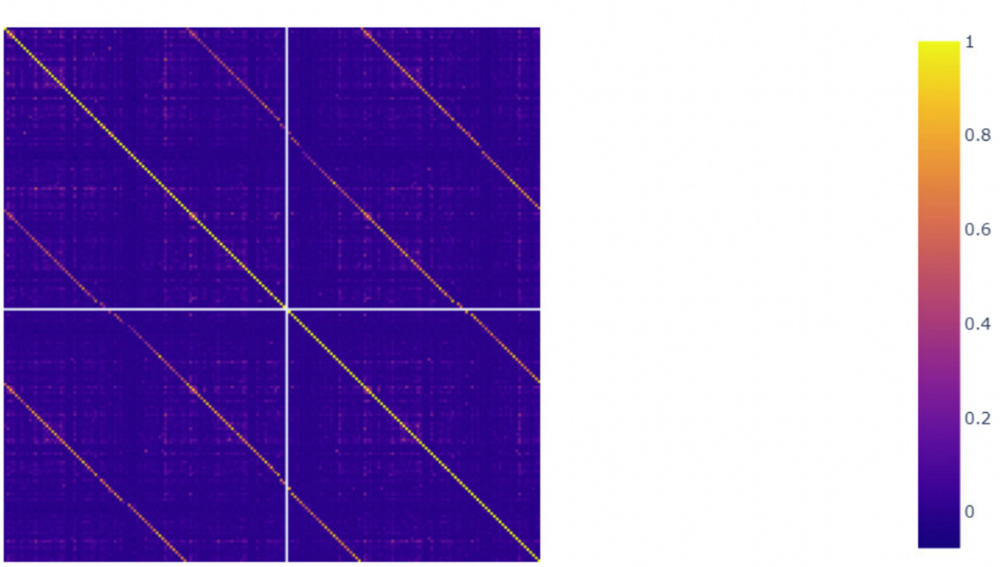
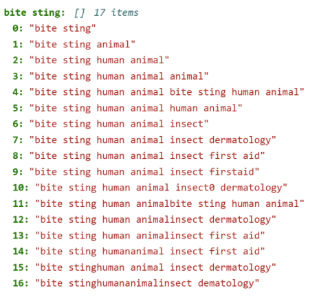
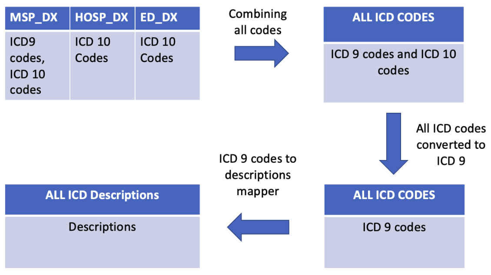
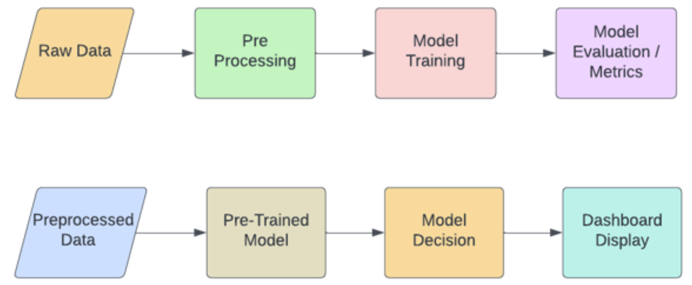
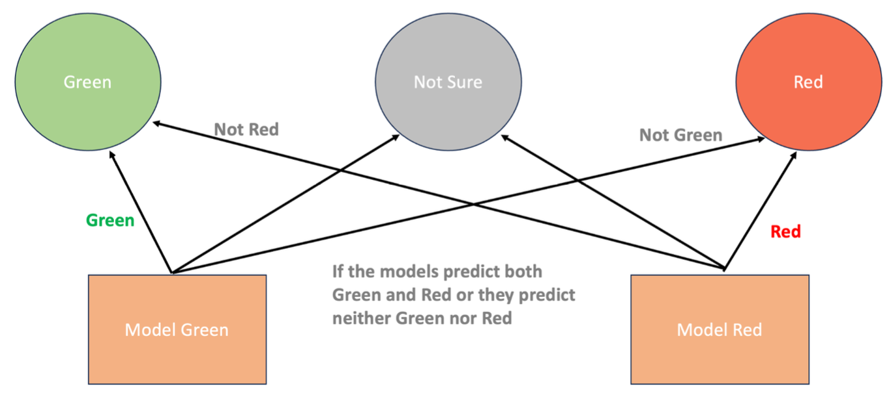
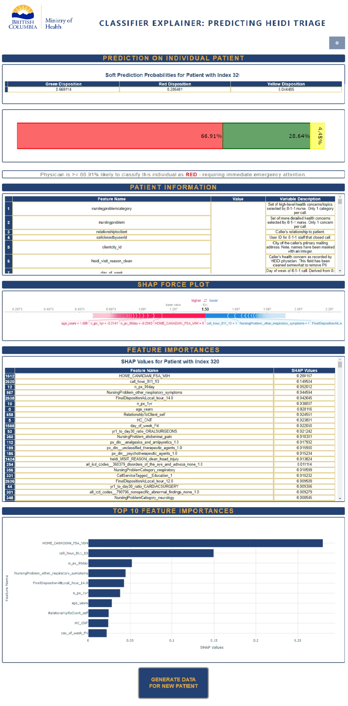

```{r setup, include=FALSE}
knitr::opts_chunk$set(echo = FALSE)
library(knitr)
library(kableExtra)
library(tidyverse)
```

```{r load model results}

```

<!-- #region tags=[] -->
# Executive Summary
<div style="text-align: justify;">
The primary objective of this initiative is to enhance the effectiveness of the 8-1-1 nurse triage model by incorporating the expertise of the HelathLink BC Emergency iDoctor in Assistance Program (HEiDi) physicians. By developing a machine learning model capable of predicting HEiDi physician disposition, the project aims to facilitate nurse triage decisions, resulting in a reduction of urgent in-person emergency department (ED) visits with utmost safety and reliability.

To ensure the data is in a usable format for the model, various techniques were employed, including pre-processing tasks such as encoding, scaling, and imputation. Additionally, International Classification of Diseases (ICD) and Drug Identification Number (DIN) decoding, along with knowledge-based feature engineering, were utilized to improve data cleanliness and quality.

The project encompassed several key components, including the establishment of an automated data pipeline, model training and validation, development of a user-friendly dashboard/GUI for visualization purposes for the nurse, and the compilation of a comprehensive final report and documentation.

During the Exploratory Data Analysis phase, a meticulous examination of the data was conducted, identifying the relevant features crucial for our partner's predictive inquiries. Simultaneously, features that did not contribute significant value to the model's prediction were identified and subsequently dropped during the pre-processing stage.

We recommend continuity in fine-tuning the model to improve scoring metrics of the model at times when the new data is available. We recommend continuity in fine-tuning the model to improve scoring metrics of the model at times when new data becomes available. To conclude, we firmly believe that this project makes a significant contribution to the healthcare industry by leveraging the expertise of HEiDi physicians to enhance the 8-1-1 nurse triage model.
</div>

# 1. Introduction
<div style="text-align: justify;">
In April 2020, the HealthLink BC Emergency iDoctor-in-assistance (HEiDi) service was introduced as an innovative approach to enhance the existing 8-1-1 nursing call flow by incorporating virtual physicians (@HoE635). This integration aimed to provide comprehensive support for caller triage and improve the efficiency of healthcare services. The main motive of the project is to significantly reduce urgent in-person visits to the emergency department whereas not required, while ensuring patient safety remains a top priority.
</div>
## 1.1 Data
<div style="text-align: justify;">
The data set comprised a consolidation of data from various sources such as the Medical Services Plan and PharmaNet. The resulting data set consisted of de-identified records of 33,597 patients. It encompassed a diverse range of data types including numerical, categorical, and binary columns, with the predominant portion consisting of numerical columns, both in float and integer formats. It's worth noting that the data set specifically focused on more severe calls that successfully reached a physician, rather than encompassing all 811 calls.
</div>
## 1.2 Objectives
<div style="text-align: justify;">
The main objectives of our project were (1) to extend the HEiDi physician expertise to the 8-1-1 nurse triage model to further reduce urgent in-person ED visits safely and reliably; (2) to gain insights on the most important features for the prediction task; (3) to identify any patterns in predicting two major classes “md_red” and “md_green”.

Refined data tasks include (1) Preprocess and analyse data using machine learning (ML) techniques to address predictive inquiry, (2) Build ML model with less false positives while keeping rate of false negatives at bay and (3) Build user-friendly dashboard for the nurse to interact with.
</div>
# 2. Data Science Methods
<div style="text-align: justify;">
Our data contains numerical, categorical, and binary data arranged in a tabular format. For this reason, and based on the relevant literature (@Spangler19007021), we decided to use linear-, and tree-based models in our initial approach. Specifically, we tested Decision Tree, Random Forest (@Wang2023), Logistic Regression, and XGBoost (@Inokuchi2022) models. We found XGBoost to be the best performer through our tests and decided to implement this model into the nurse dashboard. Towards the end of the capstone, we explored a different approach to our modelling technique. A new idea of training two separate classifiers and then combining each one's decision led to a significant boost in our models performance.
</div>

## 2.1 Preprocessing
<div style="text-align: justify;">
During the pre-processing stage, several transformations were applied to the data set to ensure its suitability for subsequent modelling and analysis. We eliminated redundant features and columns that did not contribute significantly to our predictions, based on the insights gained from the analysis as well as domain expertise provided by the partners. We also dropped columns with more than 95% missing data to ensure the quality and reliability of the dataset.

During the pre-processing phase, specific attention was given to the number of claims features, which consisted of 189 columns. These columns could be categorized into three groups, representing data for the past 1 year, 90 days, and 30 days. Through exploratory data analysis (EDA)(**Figure 1**), it was observed that there existed a correlation among the values from these different time frames. To reduce the dimensionality of the feature space and capture the relevant information, a combination of the 1-year and 30-day ratios was calculated. This combination allowed us to condense the original 189 columns into a more manageable set of 63 columns. It was determined that including the 90-day ratio in the calculation would introduce redundant correlation, thus it was not included in the combination.

```{r fig.align='center'}

```
<div style="text-align: center;">
<font size="2"><b>Figure 1.</b> This plot illustrates the correlation heatmap that visualizes the relationship between the number of claims for various specialty types, such as "Radiology", "Respirology", and "Gastroenterology", recorded over different time periods (30-days, 90-days, 1-year).</font>
</div>

One of the few important pre-processing steps involved the chronic disease feature, where multiple values per observation were converted into separate features using one-hot encoding. This expansion of the feature space was necessary to meet the model's input requirements, despite resulting in an increased number of features.
 
Another pre-processing step focused on extracting the hour component from the FinalDispositionAtLocal feature, which represented a timestamp. By isolating the hour at which the final disposition was made, we aimed to capture valuable temporal patterns associated with the decision-making process. This extraction not only provided a more concise representation of time but also significantly reduced the number of categories within this feature, facilitating its encoding using one-hot encoding.

Caller's health concern as recorded by HEiDi physician feature underwent some cleaning process to standardize the levels. During the cleaning process, mappings were applied to categorize and standardize the recorded health concerns. This involved mapping similar or related health concerns to a common category or level, ensuring a consistent representation across the data set.

The visit reason column was another one of the columns that had a lot of categories that were essentially the same. To address this, we employed cosine similarity scores to identify and group similar categories, resulting in the creation of a mapping dictionary. For instance, categories like "bite sting animal" and "bite sting human animal" were mapped as "bite sting". This process significantly reduced the number of unique categories in this column from 550 to 272.

```{r fig.align='center'}

```
<div style="text-align: center;">
<font size="2"><b>Figure 2.</b> A sample key-value pair of the mapping dictionary for HEiDi Visit Reason Column.</font>
</div>

The DIN numbers within the data set underwent extensive pre-processing to be of use as predictors. To achieve this, a DIN mapping was created by matching the DIN numbers with standardized medicine categories.

```{r fig.align='center'}

```
<div style="text-align: center;">
<font size="2"><b>Figure 3.</b> Mapping DIN Numbers to their respective categories.</font>
</div>

To ensure the effective integration of ICD codes into the model, specific preprocessing steps were implemented. The columns msp_dx, hosp_dx, and ed_dx, which contained both ICD-9 and ICD-10 codes, were combined into a single column to consolidate all the ICD codes. Subsequently, an ICD-10 to ICD-9 converter was applied to harmonise the codes. Finally, all the ICD codes were mapped to their corresponding categories, significantly reducing dimensionality of the data.

```{r fig.align='center'}

```
<div style="text-align: center;">
<font size="2"><b>Figure 4.</b> Feature Engineering on ICD Codes.</font>
</div>

To divide the data set into training and testing sets, an 80/20 split was chosen based on the available ~33,000 patient records. The larger training size was selected to facilitate cross-validation with a higher number of folds, providing more reliable and robust model evaluation. Moreover, a patient-centric approach was adopted to ensure consistency for individuals with multiple entries in the data set. This approach grouped all observations related to a particular caller within the same set (either train or test), avoiding any separation between the two. The PHN (Personal Health Number) column served as a unique identifier to facilitate this splitting strategy.

Additionally, during the pre-processing stage, appropriate imputation strategies were employed to handle missing values in the data set. For categorical variables, the "most frequent" strategy was applied, where missing values were replaced with the most frequently occurring value within each respective category. This approach ensured that the imputed values aligned with the dominant class distribution, maintaining the integrity of the categorical feature representation.

On the other hand, for numeric columns, the "mean" imputation strategy was used. Missing values within these columns were replaced with the mean value of the available data points. By imputing the missing values with the mean, we aimed to preserve the central tendency of the numerical feature, providing a reasonable estimation for the missing entries.
</div>

## 2.2 Data Pipeline
<div style="text-align: justify;">
The Data pipeline was one of the main deliverable in the project. The goal was to create an end to end machine learning pipeline that could clean, preprocess data, train and evaluate machine learning models.

```{r fig.align='center'}

```
<div style="text-align: center;">
<font size="2"><b>Figure 5.</b> High level flow of our machine learning pipeline.</font>
</div>

As could be seen from **Figure 5**, our data pipeline involved a series of steps to transform raw data into a trained model and assess its performance. The process begun with pre-processing the raw data, which included tasks like cleaning, handling missing values, and encoding variables. The pre-processed data was then used to train the model, adjusting some parameters to optimize performance. Once trained, the model was able to make predictions on new data. Evaluation metrics such as accuracy, precision were used to assess the model's performance. The model was then integrated into the dashboard, providing a visual representation of model prediction on a single patient. This pipeline enabled the transformation of raw data into actionable insights through pre-processing, model training, decision-making, evaluation, and visualization.
</div>

## 2.3 XGBoost
<div style="text-align: justify;">
XGBoost is a powerful tree based Machine Learning algorithm that enhances predictive performance using gradient boosting techniques. XGBoost was the highest performing model used by (@Inokuchi2022). From our analysis, we found XGBoost to be the best performer thus far (**Table 5**). We further attempted to improve this model by tuning the model hyperparameters. After over 40 hours of iterations, we still did not observe any significant improvement in the model performance metrics.
</div>

## 2.4 Dual Model
<div style="text-align: justify;">
Despite suboptimal results from the best model (**Table 5**), we gained valuable insights from our meeting with the nurse. Particularly, the "md_yellow" prediction class was deemed irrelevant in the triage decision. Therefore, we made a slight alteration by changing the target variable to two categories instead of three and employing two models instead of one.

To streamline the triage process, we divided it into two binary classification tasks. "Model green" predicted between "md_green" and "not_green," while "model red" focused on "md_red" and "not_red." This approach allowed each model to address a specific class, resulting in more accurate and targeted triage decisions.

The final decision was determined through a simple rule-based approach, combining the outputs of both models (**Figure 6**). For example, if "model green" predicts green and "model red" predicts "not_red," the final decision is green. This approach ensured confident predictions and allowed flexibility in adjusting individual model thresholds. Due to time constraints, we tested this approach using the Logistic Regression model, which required the least fitting time.

```{r fig.align='center'}

```
<div style="text-align: center;">
<font size="2"><b>Figure 6.</b> Decision making process for dual Logistic Regression.</font>
</div>
</div>

## 2.5 Results
<div style="text-align: justify;">
Before we dive into the results of our analysis, we should shed some light on the metrics we decided to utilize and focus on in this project.

In the context of our problem statement, we are using precision and recall as our primary evaluation metrics. However, this is a multi-classification problem (precision and recall are only calculated for binary classes). We therefore have calculated the precision and recall by taking ‘macro’ average. This means that the precision and recall are calculated with respect to each individual target class and then the average of them is taken as the metric.

With this in mind, our initial model indicates quite a poor performance on the validation set. The tree based models are clearly overfitting the training data. XGBoost outperforms the other classifiers.

<div style="text-align: center;">
<font size="2"><b>Table 1:</b> Cross-Validation results from initial model testing.</font>
</div>
| Model | Test Accuracy | Train Accuracy | Test Recall (Macro) | Train Recall (Macro) | Test Precision (Macro) | Train Precision (Macro) |
| :-----: | :-----: | :-----: | :-----: | :-----: | :-----: | :-----: |
| dummy               | 0.48 | 0.48 | 0.33 | 0.33 | 0.33 | 0.33 |
| decision_tree       | 0.52 | 1.00 | 0.36 | 1.00 | 0.36 | 1.00 |
| random_forest       | 0.63 | 1.00 | 0.34 | 1.00 | 0.36 | 1.00 |
| logistic_regression | 0.45 | 0.55 | 0.43 | 0.59 | 0.41 | 0.51 |
| xgboost             | 0.63 | 0.75 | 0.36 | 0.52 | 0.45 | 0.87 |

In an attempt to deal with the class imbalance, we used a common technique called SMOTE (@Inokuchi2022). Cross validation results after applying SMOTE seemed quite promising.

<div style="text-align: center;">
<font size="2"><b>Table 2:</b> Cross-Validation results after applying SMOTE-NC.</font>
</div>
| Model | Test Accuracy | Train Accuracy | Test Recall (Macro) | Train Recall (Macro) | Test Precision (Macro) | Train Precision (Macro) |
| :-----: | :-----: | :-----: | :-----: | :-----: | :-----: | :-----: |
| dummy               | 0.32 | 0.33 | 0.32 | 0.33 | 0.32 | 0.33 |
| decision_tree       | 0.59 | 1.00 | 0.59 | 1.00 | 0.59 | 1.00 |
| random_forest       | 0.76 | 1.00 | 0.76 | 1.00 | 0.77 | 1.00 |
| logistic_regression | 0.63 | 0.68 | 0.63 | 0.68 | 0.63 | 0.68 |
| xgboost             | 0.74 | 0.82 | 0.74 | 0.82 | 0.75 | 0.84 |

Upon comparing the test set results in the Table 3 (with SMOTE-NC) and Table 4 (without SMOTE-NC), it became evident that the application of SMOTE did not yield the anticipated outcomes. Despite promising improvements observed during cross-validation, the results obtained from the test set highlighted that SMOTE led to increased overfitting and poorer performance compared to the model without it. For reference, please refer to the accompanying figures in the text below.

<div style="text-align: center;">
<font size="2"><b>Table 3:</b> Test results with SMOTE-NC.</font>
</div>
| Model | Precision (macro) | Recall (Macro) | Accuracy |
| :-----: | :-----: | :-----: | :-----: |
| dummy               | 0.33 | 0.34 | 0.33 |
| decision_tree       | 0.34 | 0.34 | 0.44 |
| random_forest       | 0.39 | 0.37 | 0.59 |
| logistic_regression | 0.41 | 0.42 | 0.53 |
| xgboost             | 0.39 | 0.38 | 0.54 |

<div style="text-align: center;">
<font size="2"><b>Table 4:</b> Test results without SMOTE-NC.</font>
</div>
| Model | Precision (macro) | Recall (Macro) | Accuracy |
| :-----: | :-----: | :-----: | :-----: |
| dummy               | 0.33 | 0.33 | 0.49 |
| decision_tree       | 0.34 | 0.34 | 0.50 |
| random_forest       | 0.36 | 0.34 | 0.65 |
| logistic_regression | 0.41 | 0.44 | 0.45 |
| xgboost             | 0.46 | 0.36 | 0.64 |

Despite incorporating additional features through feature engineering and making further enhancements to our preprocessor, the overall performance of the model only showed a marginal improvement. While we had anticipated significant gains, the incremental progress achieved was relatively modest. This suggests that the original features already captured a substantial portion of the predictive power.

<div style="text-align: center;">
<font size="2"><b>Table 5:</b> Cross-Validation results post feature engineering.</font>
</div>
| Model | Test Accuracy | Train Accuracy | Test Recall (Macro) | Train Recall (Macro) | Test Precision (Macro) | Train Precision (Macro) |
| :-----: | :-----: | :-----: | :-----: | :-----: | :-----: | :-----: |
| dummy               | 0.48 | 0.48 | 0.33 | 0.33 | 0.33 | 0.33 |
| decision_tree       | 0.52 | 1.00 | 0.36 | 1.00 | 0.36 | 1.00 |
| random_forest       | 0.64 | 1.00 | 0.34 | 1.00 | 0.37 | 1.00 |
| logistic_regression | 0.45 | 0.55 | 0.44 | 0.59 | 0.41 | 0.51 |
| xgboost             | 0.63 | 0.74 | 0.36 | 0.51 | 0.47 | 0.87 |

Our new approach, which involved utilizing a Dual Logistic Regression model, proved to be highly effective in achieving the best performance on the test set. Through this innovative approach and as could be seen in the **Table 6**, we were able to optimize the model's predictive capabilities and obtain superior results compared to previous methods.

<div style="text-align: center;">
<font size="2"><b>Table 6:</b> Metrics for individual models in the Dual Logistic Regression.</font>
</div>
| Metric | Score |
| :-----: | :-----: |
| train_precision_green | 0.75 |
| test_precision_green  | 0.72 |
| train_precision_red   | 0.82 |
| test_precision_red    | 0.81 |
| train_recall_green    | 0.64 |
| test_recall_green     | 0.61 |
| train_recall_red      | 0.67 |
| test_recall_red       | 0.64 |

By combining the decisions of the two models, as mentioned previously, we were able to achieve our highest precision score of 0.76 and highest recall score of 0.64 on the test set (**Table 6**). This signifies a significant improvement in the overall performance of our prediction system. 
</div>

# 3. Data Product
<div style="text-align: justify;">
We have delivered a private project repository as the data product for the HEiDi project. The repository contains well-documented source code, detailed results, reports, and supplementary notebooks. It serves as comprehensive documentation for the HEiDi team's data collection efforts and future integration with their testing.

The repository includes a dashboard designed for triage nurses (**Figure 7**). Its purpose is to provide real-time information and insights to support informed decision-making in the triage process. The dashboard consists of four panels: "Model Output," "Patient Information," "SHAP Force Plot," and "Feature Importances."

```{r fig.align='center'}

```
<div style="text-align: center;">
<font size="2"><b>Figure 7.</b> The image showcases the ClassifierExplainer dashboard, designed to provide real-time information and support for informed decision-making in the triage process. The dashboard consists of four panels arranged by importance, with the top section displaying the model's output and predictions. The rest of the panels are:  "Patient Information," "SHAP Force Plot," and "Feature Importances”.</font>
</div>

The panels are arranged by importance, with the model output section at the top for quick assessment of the patient's condition. The subsequent sections provide additional details and explanations to enhance the nurse's understanding of the prediction. The dashboard facilitates class distribution understanding, optimises tasks, and streamlines triage operations.

In the "Prediction on Individual Patient" panels, the likelihood of classes is assigned to each patient, accompanied by a confidence measure. A bar chart visually represents the class distribution, and a prediction label reiterates the model's output.

The "Patient Information" panel displays relevant features and their values, with brief explanations. The "SHAP Force Plot" panel illustrates the impact of each feature on the prediction. The "Feature Importance" panel presents the importance of each feature in a sorted tabular format.

The dashboard empowers triage nurses to make informed decisions, saves time, and enhances operational efficiency. While it offers benefits like simplified class distribution understanding and streamlined triage, nurses should be cautious not to overly rely on the model's predictions, potentially undermining their clinical judgement.

Improvements could involve additional visualizations, expanded feature analysis, or incorporating feedback mechanisms. However, implementing these may face challenges such as resource constraints or technical complexities. Given our project's scope and resources, we prioritised developing a functional dashboard that meets core objectives and provides valuable insights to triage nurses.
</div>

# 4. Limitations of the Project
<div style="text-align: justify;">
One of the biggest obstacles encountered during the project was hardware limitations. The XGBoost model, even with just 20 iterations, took over 40 hours to run. This significantly impacted the efficiency and speed of model development. With access to more computational resources, such as high-performance computing clusters, the quality of the models could be greatly enhanced through extensive parameter tuning and optimization.
 
Another limitation of the project was the availability of data, both in terms of quality and quantity. Higher quality data would have reduced the need for the model to fill in gaps and missing values, leading to improved performance and accuracy. Additionally, having a larger quantity of data would have provided more diversity, allowing the model to learn a wider range of patterns and better generalize its predictions.
</div>

# 5. Conclusion and Recommendations
<div style="text-align: justify;">
In conclusion, this initiative aimed to enhance the 8-1-1 nurse triage model by incorporating the expertise of HEiDi physicians. By developing a machine learning model that predicts HEiDi physician disposition, we aimed to improve nurse triage decisions, leading to a reduction in urgent in-person emergency department visits while prioritizing patient safety.

Our initial analysis showed that XGBoost was the best performing model. However, the application of SMOTE-NC did not yield the anticipated improvements, and the models showed increased overfitting. As a result, we introduced a dual model approach, which divided the triage decision into two binary classification tasks and combined the outputs to make the final decision. Logistic Regression was used for this approach.

Moving forward, we recommend further fine-tuning of the models to improve their scoring metrics when new data becomes available. A significant aspect that holds potential for improvement is the feature engineering stage, particularly concerning DIN numbers and ICD codes. By refining the techniques used to engineer features from these variables, it becomes possible to extract more valuable insights and enhance the model's predictive performance. An interesting approach to explore is the hierarchical grouping of DIN numbers and ICD codes, which could potentially provide insights into the urgency or priority levels associated with nurse’s disposition. By incorporating this hierarchical structure, the model may benefit from a more nuanced understanding of the data and make more informed predictions.
 
Another avenue to consider is feature selection, which can help reduce the input data size and computational complexity. By identifying the most relevant and informative features, the model can be trained more efficiently, enabling the exploration of more complex computations, and potentially leading to improved results.
 
Additionally, the application of a dual model technique using alternative models or ensemble methods could be beneficial. This approach would leverage the strengths of different models and compensate for their individual weaknesses, potentially enhancing the model's predictive performance. However, it is important to note that such an approach would require additional computational resources to support the training and implementation of multiple models simultaneously.
 
Access to patient notes data could also greatly enhance the performance of the model. Leveraging natural language processing (NLP) techniques to extract valuable information from text-based patient notes has the potential to provide deeper insights and improve the model's understanding of the context surrounding each case.
</div>

# References